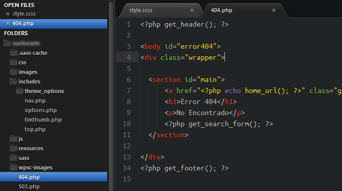

# SUBLIME TEXT DARK SIDEBAR

### Preview

## How to install:

1. Open Sublime Text and go to **Preferences -> Browse Packages**.
2. Locate the **Theme - Default folder**.
3. Open the **Files** folder and copy its content to the **Theme - Default** folder.
4. In Sublime go to **Preferences -> Setting - User** and add the following line of code:
     `"theme": "Dark.sublime-theme"`
5. Restart Sublime and you're done—This might be optional.

----------------------------------------------------------------------------------------

## Como instalar:

1. Inicia Sublime Text y ve al menú **Preferences -> Browse Packages**.
2. Localiza la carpeta **Theme - Default**.
3. Abre la carpeta **Files** y copia su contenido en **Theme - Default**.
4. En Sublime ve a **Preferences -> Setting - User** y pega la siguiente línea de código:
     `"theme": "Dark.sublime-theme"`
5. Reinicia Sublime y listo—Esto podría ser opcional.
